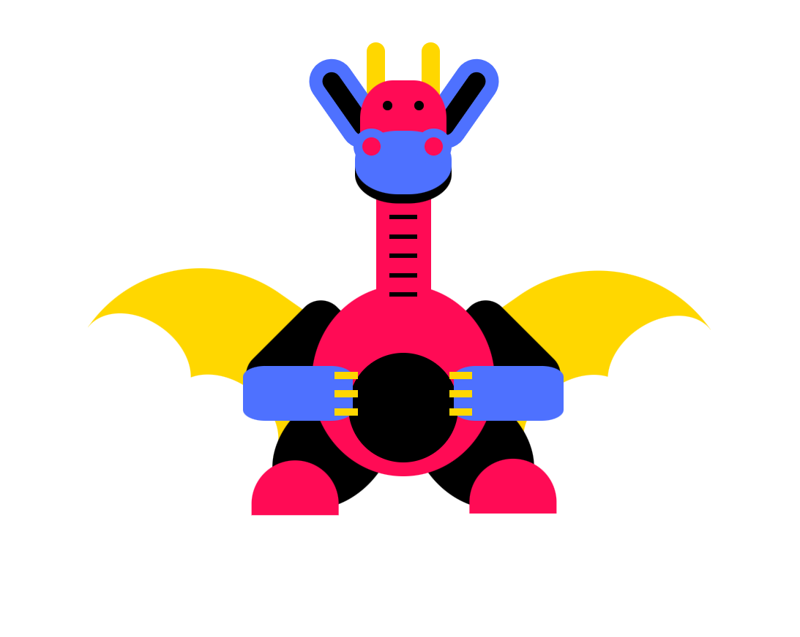
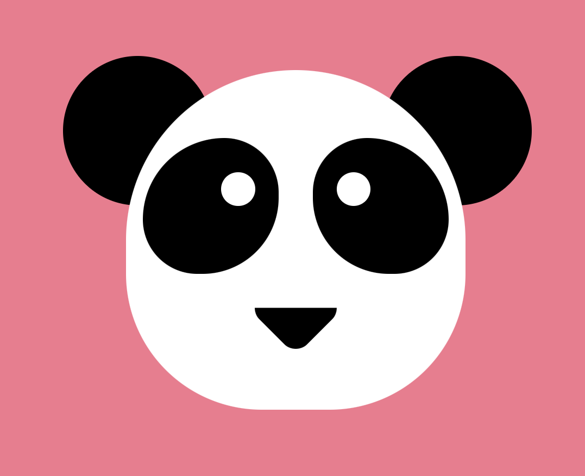
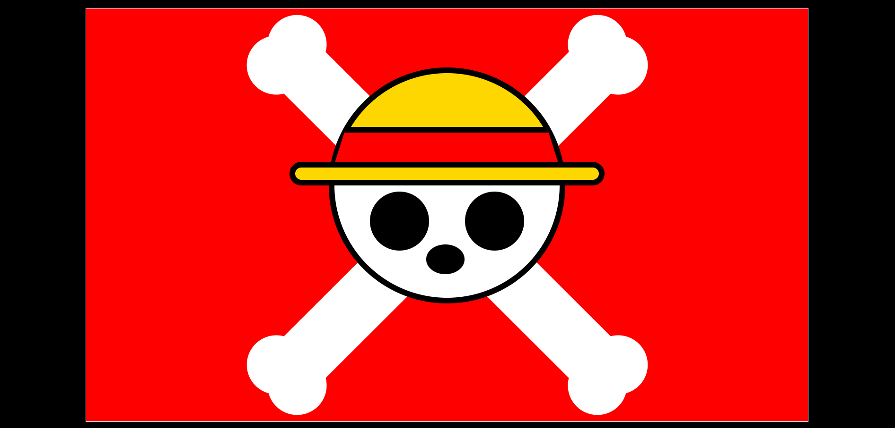

# 🖌️ CSS Projects by Kowshik

Welcome to my CSS practice repository! This repo contains various mini-projects built purely using HTML and CSS to improve layout skills, styling, creativity, and animation understanding.

---

## 📁 Project List

### ✅ Day 1: Dragon
- A creative CSS representation of a **dragon**.
- Focused on positioning, layering, and shapes using `div` elements.

---

### ✅ Day 2: Panda
- Designed a **cute panda** face using only CSS.
- Practiced `border-radius`, `box-shadow`, and `transform` properties.

---

### ✅ Day 3: Luffy Flag (One Piece)
- Built **Luffy's Pirate Flag** using CSS.
- Leveraged `position: absolute`, shapes with `clip-path`, and gradient backgrounds.

---
